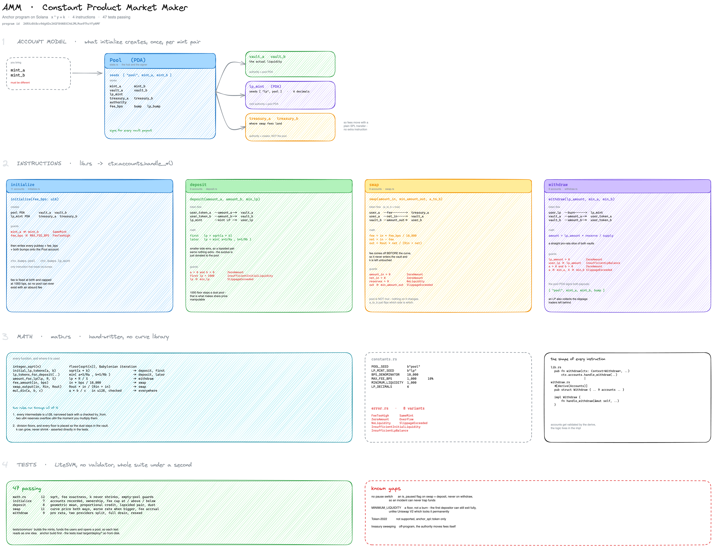
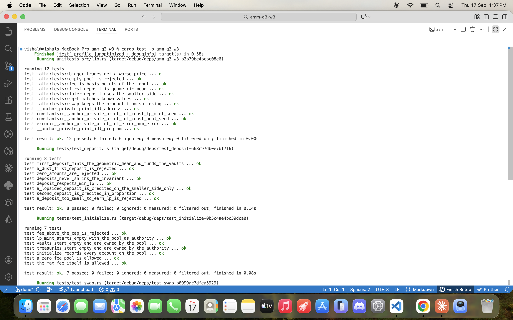
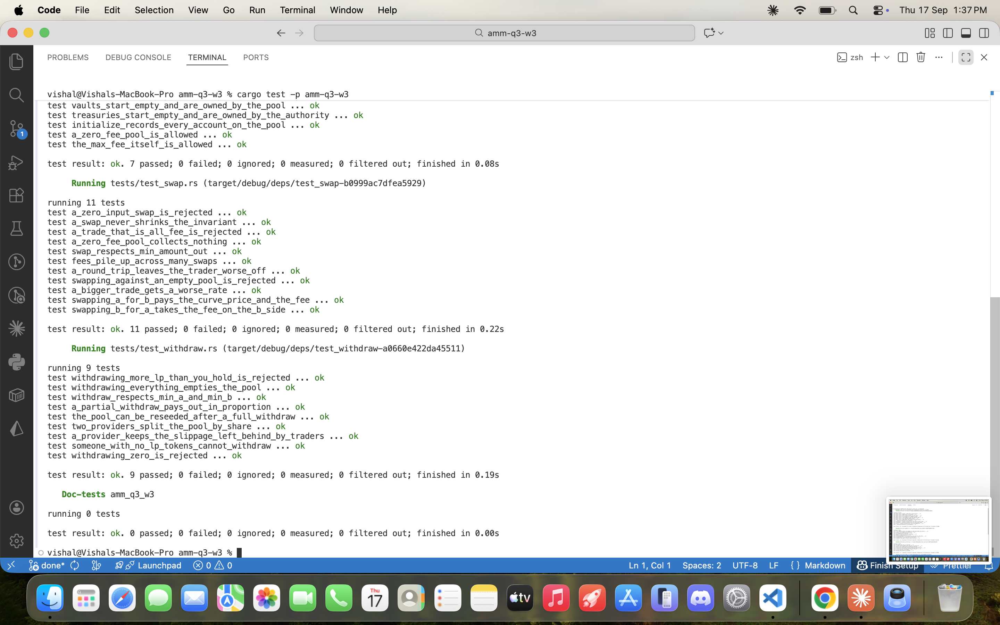

# AMM — Constant Product Market Maker

A Solana AMM written in Anchor. Two-token pools on the `x * y = k` curve, with
LP tokens, a configurable swap fee and per-pool treasury accounts.

**Program ID:** `2KRXzBtBcv9dgKDx2KGF84N8XCHdJMLMse97hzYFpNMF`

---

## Assignment status

| # | Task | Status |
|---|------|--------|
| 1 | Write the AMM program | ✅ Done |
| 2 | Add fees and treasury account | ✅ Done |
| 3 | Write tests covering all the instructions | ✅ Done — 47 tests, all passing |
| 4 | *(Optional)* Implement a CPMM without using the library | ✅ Done — all curve math hand-written in [`math.rs`](programs/amm/src/math.rs), no `spl-math` / curve crate |
| 5 | *(Optional)* Reason about mitigating downtime | ✅ Done — [see below](#5-mitigating-downtime-in-a-defi-app) |
| — | Well-written README | ✅ This file |
| — | Screenshot of tests passing | ✅ [See below](#test-run) |

---

## The whole thing on one page



Account model, all four instructions with their token flows and guards, the
hand-written math, and the test breakdown. Source is
[`architecture.excalidraw`](programs/amm/docs/architecture.excalidraw) — open it
at [excalidraw.com](https://excalidraw.com) to edit.

The rest of this README is the same material in prose.

---

## 1. The program

Four instructions, all in [`programs/amm/src/instructions/`](programs/amm/src/instructions/).

### `initialize(fee_bps: u16)`

Creates a pool for a mint pair. One transaction sets up everything the pool
will ever need:

- **Pool PDA** — seeds `["pool", mint_a, mint_b]`. Holds all config and is the
  authority over both vaults and the LP mint.
- **`vault_a` / `vault_b`** — token accounts owned by the pool PDA. This is
  where liquidity actually sits.
- **LP mint** — PDA, seeds `["lp", pool]`, 6 decimals, mint authority is the
  pool PDA. Nobody outside the program can mint LP.
- **`treasury_a` / `treasury_b`** — token accounts owned by `authority`.

`fee_bps` is validated against `MAX_FEE_BPS` (1,000 bps = 10%) at creation, so
a pool can never exist with an absurd fee. Zero is allowed.

### `deposit(amount_a, amount_b, min_lp)`

Adds liquidity and mints LP tokens.

- **First deposit** — `lp = sqrt(amount_a * amount_b)`, the geometric mean.
  This must exceed `MINIMUM_LIQUIDITY` (1,000), which stops a pool being opened
  with dust — the setup that makes LP share price manipulable.
- **Later deposits** — `lp = min(amount_a * supply / reserve_a, amount_b * supply / reserve_b)`.
  Credit goes to whichever side is proportionally *smaller*, so sending a
  lopsided pair earns nothing extra; the surplus is simply donated to the pool.
- `min_lp` is the caller's slippage floor.

### `withdraw(lp_amount, min_a, min_b)`

Burns LP and returns a proportional slice of both vaults:
`amount = lp_amount * reserve / lp_supply`, paid out by the pool PDA signing
for both vaults. `min_a` / `min_b` guard against the ratio moving underneath
the transaction.

### `swap(amount_in, min_amount_out, a_to_b)`

Trades along the curve in either direction — `a_to_b` picks the side, so one
instruction handles both.

```
fee        = amount_in * fee_bps / 10_000
net_in     = amount_in - fee
amount_out = reserve_out * net_in / (reserve_in + net_in)
```

Three transfers happen: the fee goes to the treasury on the input side, the net
input goes to the input vault, and the output leaves the output vault signed by
the pool PDA.

---

## 2. Fees and treasury

The fee is **taken off the input before the curve is applied**, which is the
detail that matters. Because the fee never enters the vault, it does not change
`k` — the curve prices the trade on `net_in` alone, and the skim is a clean
side-effect rather than something LPs have to account for.

- `fee_bps` is stored per-pool and capped by `MAX_FEE_BPS` at initialize.
- Fees land in `treasury_a` or `treasury_b` depending on trade direction, so
  the protocol accrues real balances of both tokens.
- The treasuries are owned by `authority`, not the pool PDA. That is
  deliberate: the protocol can sweep them with an ordinary SPL transfer and no
  extra instruction is needed on this program.

---

## 3. Tests

**47 tests, all passing.** [LiteSVM](https://github.com/LiteSVM/litesvm) for the
integration tests — no local validator, whole suite runs in well under a second.

```
programs/amm/tests/
├── common/            shared TestEnv: builds mints, funds users, opens a pool
├── test_initialize.rs  7 tests
├── test_deposit.rs     8 tests
├── test_swap.rs       11 tests
└── test_withdraw.rs    9 tests
                       + 12 unit tests in math.rs
```

Coverage is behavioural rather than line-chasing. A sample of what is asserted:

| Area | Examples |
|------|----------|
| **initialize** | every account recorded on the pool; vaults owned by the pool; LP mint authority is the pool and *not* the creator; fee above cap rejected; fee at exactly the cap accepted; zero-fee pool allowed |
| **deposit** | first deposit mints the geometric mean; second deposit credited in proportion; a lopsided pair only earns on the smaller side; dust first deposit rejected; `min_lp` enforced; the invariant never shrinks |
| **swap** | curve price and fee both correct in each direction; bigger trades get a worse rate; a round trip leaves the trader down by the fee; `min_amount_out` enforced; fees accumulate across many swaps; zero-fee pool collects nothing; empty pool and zero input rejected; a trade that is all fee rejected |
| **withdraw** | partial withdraw pays out pro rata; two providers split by share; withdrawing everything empties the pool; the pool can be reseeded afterwards; an LP earns the slippage traders left behind; over-withdraw and no-LP callers rejected |
| **math** | `integer_sqrt` against known values; fee is exact basis points; `k` never shrinks on a swap; empty-pool guards |

### Running them

```bash
anchor build          # required — the tests load target/deploy/amm_q3_w3.so
cargo test -p amm-q3-w3
```

> `anchor build` first, every time. The LiteSVM tests load the compiled `.so`
> from disk; skip the build and you are testing stale bytecode.

### Test run

`cargo test -p amm-q3-w3` — 47 passed, 0 failed, across five suites.

**Part 1** — math unit tests, `deposit`, `initialize`:



**Part 2** — `swap`, `withdraw`:



| Suite | Tests | Result |
|-------|-------|--------|
| `math` (unit) | 12 | ok |
| `test_initialize` | 7 | ok |
| `test_deposit` | 8 | ok |
| `test_swap` | 11 | ok |
| `test_withdraw` | 9 | ok |
| **Total** | **47** | **0 failed** |

---

## 4. CPMM without a library

No curve library is used. [`math.rs`](programs/amm/src/math.rs) implements the
whole thing by hand:

- `integer_sqrt` — Babylonian / Newton iteration, for the first LP mint.
- `initial_lp_tokens`, `lp_tokens_for_deposit`, `amount_for_lp` — LP accounting.
- `fee_amount`, `swap_output` — the fee skim and the curve itself.
- `mul_div` — `a * b / c` in `u128`, erroring instead of wrapping.

Two rules run through all of it:

**Everything intermediate is `u128`.** A product of two `u64` reserves
overflows `u64` immediately, so every multiplication widens first and narrows
back with a checked `try_from` at the end. There is no unchecked arithmetic and
no `unwrap` on a value a user controls.

**Rounding always favours the pool.** Integer division floors, and every floor
is placed so the dust stays in the vault. `k` can grow, never shrink — asserted
directly in `deposits_never_shrink_the_invariant` and
`a_swap_never_shrinks_the_invariant`.

---

## 5. Mitigating downtime in a DeFi app

Solana halts are the obvious case, but most user-visible downtime is not a
chain halt — it is one RPC provider degrading while the cluster is fine. Both
need handling, and they need different handling.

**Don't depend on one RPC.** A single provider is the most common single point
of failure by a wide margin. Keep two or three endpoints, health-check them on
latency and slot lag rather than just HTTP 200, and fail over automatically. A
node that is 300 slots behind returns stale account data and looks perfectly
healthy to a naive check.

**Make the client degrade, not die.** If transactions cannot land, the frontend
should still read state and say plainly what is wrong. Cache the last known
pool reserves and show them with a timestamp. Users who cannot tell the
difference between "the chain is down" and "the app is broken" withdraw as soon
as they can, which is precisely when you least want the traffic.

**Retry with fresh blockhashes.** During congestion, dropped transactions are
normal, not exceptional. Rebuild with a current blockhash and resubmit rather
than re-sending an expiring one, and set a priority fee that adapts to recent
network conditions instead of a hardcoded constant.

**Protect users from resumption pricing.** The real danger is not the halt — it
is the first minutes after restart, when the oracle price has moved but pool
reserves have not. Every instruction here already takes a slippage bound
(`min_lp`, `min_a`/`min_b`, `min_amount_out`), so a transaction signed before a
halt cannot execute at a wildly different price after it. That is the single
most important protection an AMM can offer here, and it is enforced on-chain
rather than in the client.

**Have a pause switch, and decide who holds it.** An `is_paused` flag on the
pool, checked by `swap` and `deposit` but *not* by `withdraw`, lets you stop
trading during an incident without ever trapping user funds. Withdrawals must
stay open — a pause that blocks exits converts a technical incident into a
credibility one. This is the clearest gap in the current program and the first
thing I would add next.

**Practise recovery before you need it.** Keep the deploy reproducible, keep
the upgrade authority keys somewhere reachable under pressure, and know in
advance who decides to pause and how that decision reaches users.

---

## Layout

```
programs/amm/src/
├── lib.rs              #[program] — the four instruction entrypoints
├── constants.rs        seeds, MAX_FEE_BPS, MINIMUM_LIQUIDITY, LP_DECIMALS
├── error.rs            AmmError
├── math.rs             hand-written CPMM math + unit tests
├── state.rs            Pool account
└── instructions/
    ├── initialize.rs
    ├── deposit.rs
    ├── withdraw.rs
    └── swap.rs
```

### `Pool`

| Field | Purpose |
|-------|---------|
| `mint_a`, `mint_b` | the pair this pool trades |
| `vault_a`, `vault_b` | liquidity, owned by the pool PDA |
| `lp_mint` | LP token mint, PDA, authority is the pool |
| `treasury_a`, `treasury_b` | fee collection, owned by `authority` |
| `authority` | pool creator, owns the treasuries |
| `fee_bps` | swap fee in basis points |
| `bump`, `lp_bump` | stored so later instructions use `create_program_address` instead of re-deriving |

---

## Build

```bash
anchor build
cargo test -p amm-q3-w3
```

**Versions:** anchor-cli 1.1.2 · solana-cli 3.0.15 (Agave) · rustc 1.98.1 ·
litesvm 0.10

---

## Known gaps

Honest list of what is not there:

- **No pause switch.** Discussed in §5; not implemented.
- **`MINIMUM_LIQUIDITY` is a floor, not a burn.** The first deposit must mint
  more than 1,000 LP, but that amount is not permanently locked the way
  Uniswap V2 locks it. A first depositor can still withdraw fully.
- **Token-2022 not supported.** `anchor_spl::token` only; no transfer-fee or
  other extension handling.
- **Treasury sweeping is off-program.** The `authority` moves fees with a plain
  SPL transfer; there is no instruction here for it.
